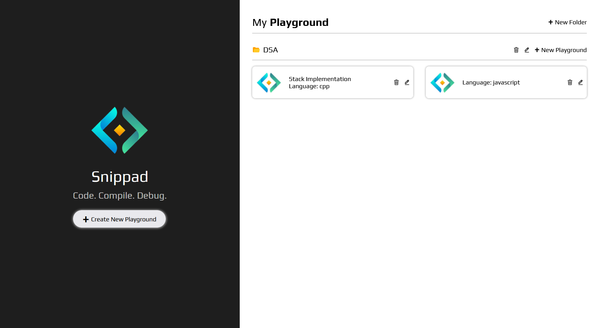
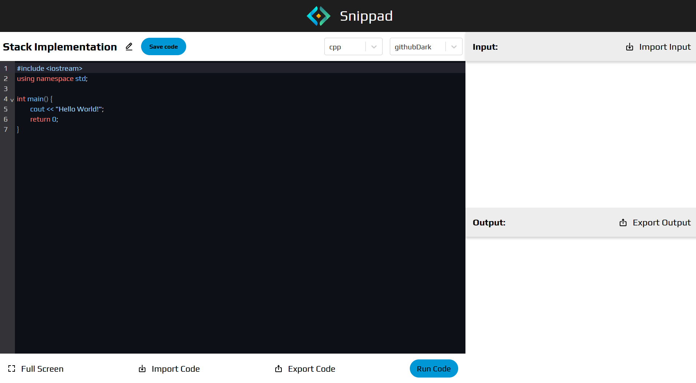

<h1 align="center"> Snippad | An Online IDE </h1>

 <b> Your personal, multi-language code playground in the browser. </b> 

  🔗 <a href="https://snippad-vert.vercel.app"><b>Live Demo → snippad-vert.vercel.app</b></a>

 

---

<h3><b>📚 Table of Contents </b></h3>
<ol>
  <samp>
    <li> <a href='#introduction'> Introduction </a> </li>
    <li> <a href='#features'> Features </a> </li>
    <li> <a href='#tech-stack'> Tech Stack </a> </li>
    <li> <a href='#demo-screenshots'> Screenshots </a> </li>
    <li> <a href='#contributions'> Contribution </a> </li>
    <li> <a href='#author'> Author </a> </li>
  </samp>
</ol>

---

<h2 id="introduction"> 1. Introduction 👋 </h2>

    <b> Snippad </b> is a sleek, multi-language online code playground powered by Judge0. With a modern interface, customizable themes, and support for file handling and persistent storage, it's the perfect space to write, run, and manage code snippets effortlessly — right from your browser.

---

<h2 id='features'> 2. Features ✨ </h2>
<ul>
  <samp>
    <li> <b>Modern Code Editor:</b> Built with ReactJS and CodeMirror, supporting syntax highlighting and fullscreen mode. </li>
    <li> <b>Multi-Language Support:</b> Run C++, Python, Java, and JavaScript using the Judge0 API via RapidAPI. </li>
    <li> <b>Customizable Themes:</b> Choose from multiple themes for a personalized coding experience. </li>
    <li> <b>File Handling:</b> Upload/download code files and input/output text files with ease. </li>
    <li> <b>Local Playground Storage:</b> Save and manage multiple code snippets in local storage.</li>
    <li> <b>Responsive Layout</b> Styled with styled-components for a clean, flexible interface.</li>    
  </samp>
</ul>

---

<h2 id='tech-stack'> 3. Technologies Used 🛠️ </h2>
<h3><b>Frontend</b></h3>
<ul>
  <samp>
    <li> <a href="https://react.dev/"> <b>React.js</b></a> for frontend framework </li>
    <li> <a href="https://styled-components.com/docs/basics"><b>Styled Components</b></a> for styling </li>
    <li> <a href="https://ce.judge0.com/"><b>Judge0 CE API</b></a> to create and get submissions </li>
    <li> <a href="https://rapidapi.com/judge0-official/api/judge0"> <b>Rapid API</b></a> for Judge0 CE API setup </li>
    <li> <a href="https://axios-http.com/docs/intro"><b>Axios</b></a> to make API calls </li>
    <li> <a href="https://reactrouter.com/en/main"><b>React Router</b></a> for routing </li>
  </samp>
</ul>

---

<h2 id='demo-screenshots'> 4. Screenshots 📷 </h2>

| Homepage |
|----------|
|  |

| Code Editor |
|----------|
|  |

---

<h2 id='contributions'> 5. Contribution 🤝 </h2>

 
    <b> Contributions are Welcome! </b>
     
    If you’d like to improve a feature or fix a bug:
  
    - Fork the repo 
    - Create a new branch (git checkout -b feature-xyz) 
    - Make your changes 
    - Push and open a PR 
    
   ⚠️ Please ensure code is clean, readable, and follows the existing architecture.

---

<h2 id='author'> 6. Author ✍️ </h2>
<h3><samp>Abhinav Mishra – <a href="https://github.com/CoderUzumaki">@CoderUzumaki</a></samp></h3>

---
